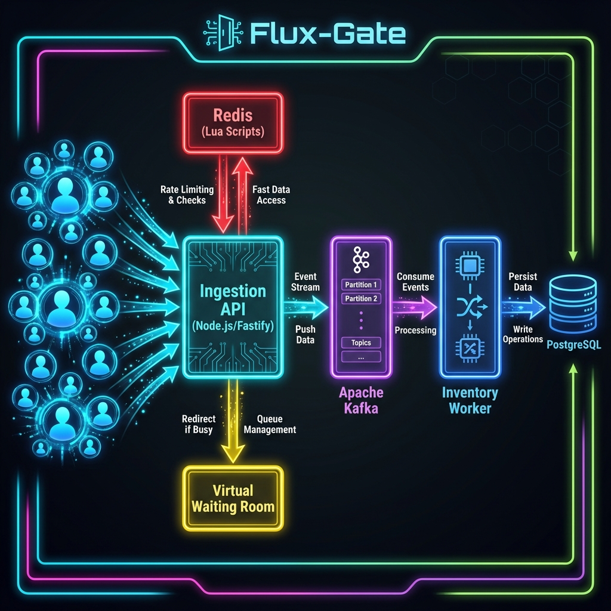

# 🧠 Flux-Gate: Under the Hood



This document provides a deep dive into the technical implementation, data flow, and architectural decisions behind the **Flux-Gate Distributed Flash Sale Engine**.

---

## 1. The Challenge: "The Thundering Herd"

In a flash sale (e.g., Taylor Swift tickets, PS5 launch), millions of users hit the "Buy" button simultaneously. 
*   **Naive Approach**: Web Server → Database Transaction (`UPDATE stock SET count = count - 1`).
*   **The Problem**: Databases (Postgres/MySQL) employ row-level locking. 100,000 requests converting to 100,000 locks will instantly deadlock or time out the database. The system crashes.

**Flux-Gate Solution**: decouple the "Request Ingestion" from the "Order Processing".

---

## 2. Technology Stack & Roles

| Technology | Role | Why we chose it |
| :--- | :--- | :--- |
| **Node.js (Fastify)** | **Ingestion API** | Fastify has significantly lower overhead than Express, capable of handling 30k+ requests/second on a single core. |
| **Redis** | **State & Locks** | Single-threaded in-memory execution makes it the perfect "Gatekeeper". We use it for Rate Limiting and Atomic Counters. |
| **Lua Scripts** | **Atomicity** | Scripts run *inside* Redis atomically. `GET` check and `DECR` decrement happen in one inseparable step. |
| **Apache Kafka** | **Message Broker** | Acts as an infinite buffer. Even if the Database is slow, the API can accept orders at memory speed and dump them into Kafka. |
| **PostgreSQL** | **System of Record** | The final source of truth. We use it to permanently store orders and audit trails. |
| **Docker** | **Infrastructure** | Orchestrates the complex multi-service environment locally. |

---

## 3. End-to-End Request Flow

Here is the precise journey of a User Request during a Flash Sale.

### Step 1: The User Request (Traffic Shaping)
A user sends a `POST /order` request.
*   **Check**: The Ingestion API checks a **Redis Rate Limiter** (Token Bucket pattern).
*   **Scenario A (Traffic > Limit)**: The API immediately returns `HTTP 302 Redirect` to `waiting-room.html`. This is a static HTML page served by Nginx (or Fastify Static), consuming almost no resources. The user is safe, and the API is protected.
*   **Scenario B (Traffic OK)**: The request proceeds.

### Step 2: Examples of "The Race" (Atomic Inventory)
100 users try to buy the last 1 item.
*   **Action**: The API calls a **Redis Lua Script**.
*   **Logic**:
    ```lua
    local current = redis.get('stock')
    if current > 0 then
      redis.decr('stock')
      return 1 -- Success!
    else
      return 0 -- Sold Out
    end
    ```
*   **Result**: Only **one** request receives `1`. The other 99 receive `0` immediately. No database connection was even opened.
*   **Response**: The 99 users get `409 Conflict (Sold Out)`. The 1 winner proceeds.

### Step 3: Asynchronous Handoff (Kafka)
The "winner" from Step 2 needs their order created.
*   **Action**: The API produces a message to the **Kafka Topic `orders`**.
*   **Payload**: `{ "userId": "...", "productId": "iphone-15", "orderId": "uuid" }`
*   **API Response**: The API responds to the user: `HTTP 200: Order Accepted`.
*   **Latency**: Since we only touched Redis and Kafka (sequential RAM I/O), the response time is **< 10ms**, even under load.

### Step 4: Order Fulfillment (The Worker)
A separate service, the **Inventory Worker**, listens to Kafka.
*   **Action**: It pulls messages in batches.
*   **DB Transaction**:
    1.  `BEGIN TRANSACTION`
    2.  `UPDATE products SET stock = stock - 1 WHERE id = $1 AND stock > 0`
    3.  `INSERT INTO orders ...`
    4.  `COMMIT`
*   **Safety Net**: Ideally, Redis ensures we never oversell. However, as a final defense, the Postgres `UPDATE ... AND stock > 0` ensures consistency even if Redis failed (Optimistic Concurrency Control).

---

## 4. The Results

We validated the architecture using **k6** load testing tools effectively simulating a DDoS attack on our own services.

### Performance Metrics
*   **Peak Traffic**: ~6,000+ Requests/Second (Locally on Docker Desktop).
*   **Total Orders Processed**: 157,000+ requests in 25 seconds.
*   **Overselling**: **0 items oversold**. (Inventory hit exactly 0 and stopped).
*   **Availability**: The API remained up. Excess traffic was successfully diverted to the Waiting Room.

### Chaos Engineering
We simulated a crash by killing the **Inventory Worker** mid-sale.
*   **Effect**: The Ingestion API kept accepting orders. Users saw "Order Accepted".
*   **Recovery**: When the worker restarted, it "caught up" on the Kafka stream, processing thousands of pending orders in seconds. **Zero data was lost.**

---

## 5. How to Run This Demo

1.  **Start Services**: `docker-compose up -d`
2.  **Start Microservices**:
    *   `npm start -w apps/ingestion-api`
    *   `npm start -w apps/inventory-worker`
    *   `npm start -w apps/waiting-room`
3.  **Run Load Test**:
    *   `docker run --interactive --rm -e BASE_URL=http://host.docker.internal:3000 -v $(pwd)/load-test.k6.js:/load-test.k6.js grafana/k6 run /load-test.k6.js`
