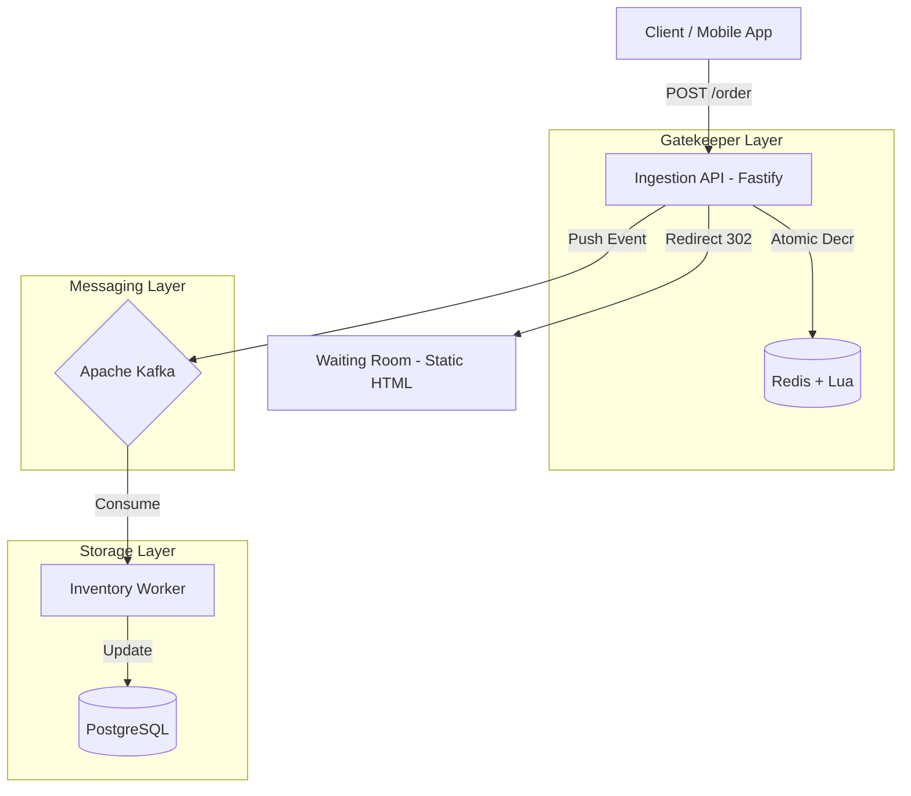

# High-Level Design (HLD) - Flux-Gate

## 1. Introduction
Flux-Gate is a distributed, high-concurrency flash sale engine built to handle extreme traffic spikes (100,000+ RPS) while ensuring zero overselling and maintaining system stability.

## 2. System Architecture
The system follows an **Event-Driven Microservices Architecture**, decoupling the synchronous ingestion of orders from the asynchronous persistence and processing.

## 3. Key Components

### 3.1 Ingestion API (The Entry Point)
- **Role**: High-performance request handler.
- **Goal**: Minimize latency and maximize throughput.
- **Behavior**: Validates basic request data, performs rate limiting, checks/decrements inventory in Redis, and pushes successful requests to Kafka. It **never** blocks on database operations.

### 3.2 Redis (The Gatekeeper)
- **Role**: Distributed cache and atomic lock provider.
- **Goal**: Ensure "Exactly-Once" inventory decrement and perform sub-millisecond rate limiting.
- **Tech**: Uses **Lua Scripts** to ensure atomicity across multiple Redis operations (GET, DECR) without expensive distributed locks.

### 3.3 Apache Kafka (The Buffer)
- **Role**: Persistent message broker.
- **Goal**: Absorb bursts of traffic and protect downstream services (DB) from melting.
- **Behavior**: Stores accepted orders in a durable topic. Acts as the "source of truth" for the asynchronous processing pipeline.

### 3.4 Inventory Worker
- **Role**: Order processor.
- **Goal**: Persist orders to the relational database.
- **Behavior**: Consumes messages from Kafka and performs bulk or single updates to PostgreSQL.

### 3.5 PostgreSQL (The Final Record)
- **Role**: Durable relational database.
- **Goal**: Store the final state of inventory and order history for analytics and fulfillment.
- **Strategy**: Uses **Optimistic Concurrency Control** (OCC) as a secondary safety net.

## 4. Design Principles
1. **Asynchronous Processing**: Immediate response to user, deferred persistence.
2. **Stateless APIs**: Services can be scaled horizontally behind a Load Balancer.
3. **Fail-Fast**: If Redis is empty, reject immediately. If traffic is too high, redirect to the Waiting Room.
4. **Idempotency**: Every order request must include an idempotency key to prevent double-charging or double-selling on retries.

## 5. Technology Justification
- **Node.js/Fastify**: Non-blocking I/O is ideal for high-concurrency API gateways.
- **Redis**: Lowest latency for atomic counters.
- **Kafka**: High-throughput distributed log, capable of handling millions of messages per second.
- **Postgres**: ACID compliance is necessary for the final "System of Record".
