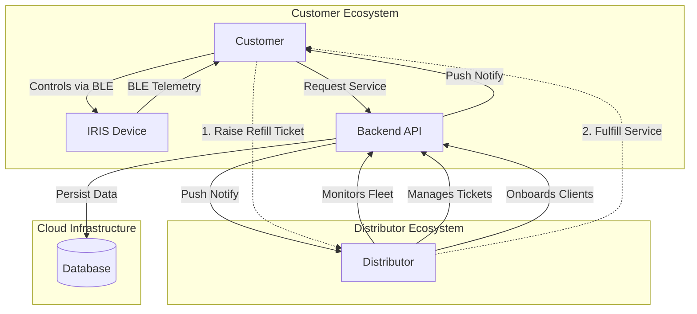
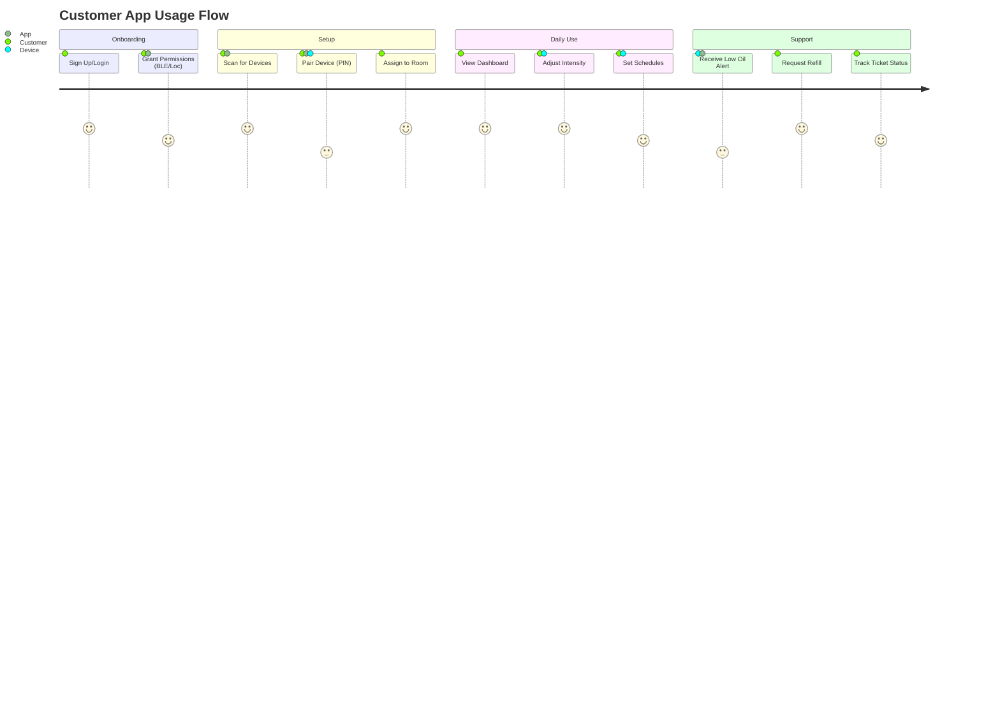
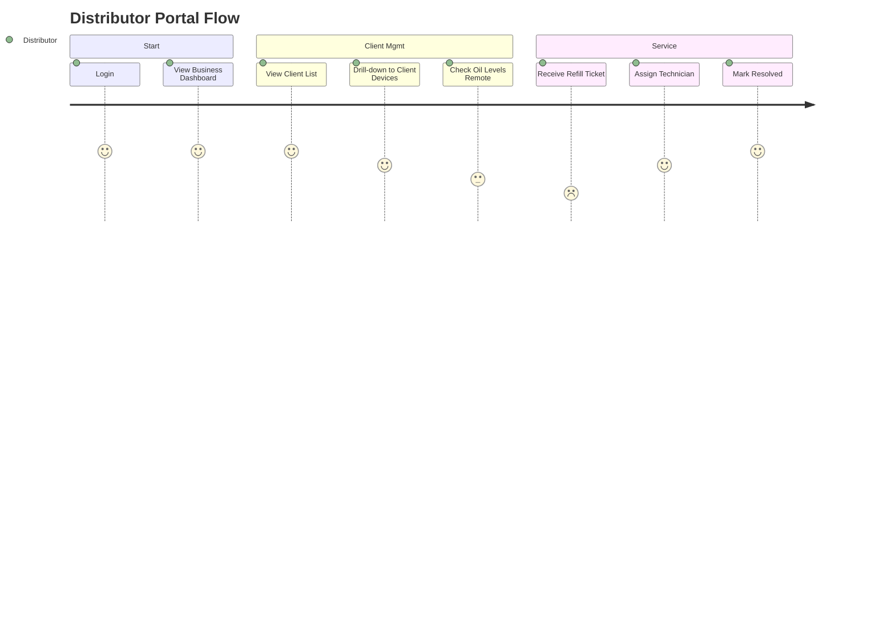
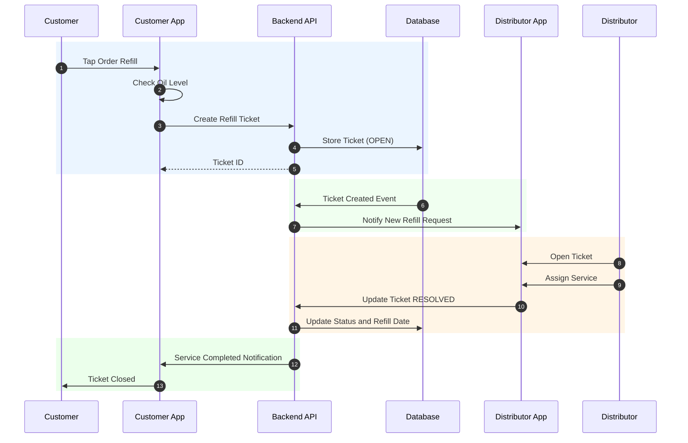
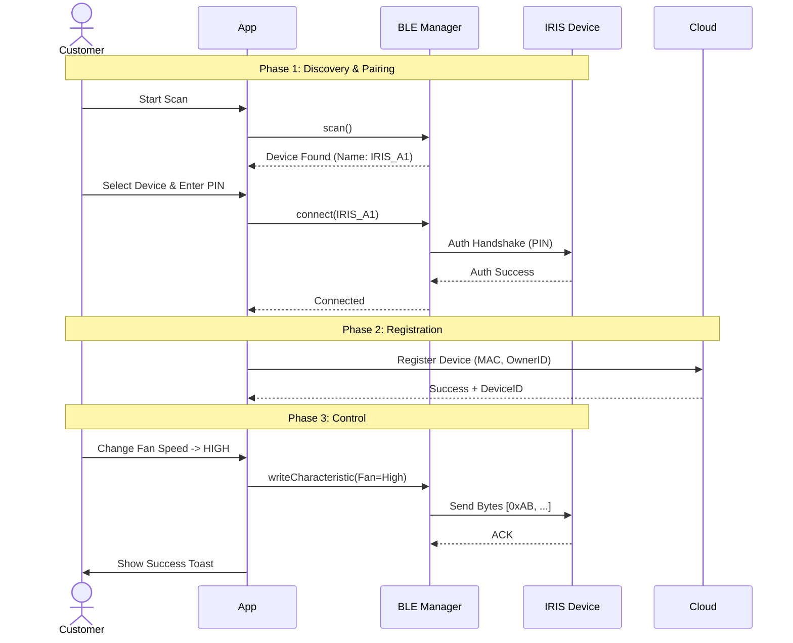
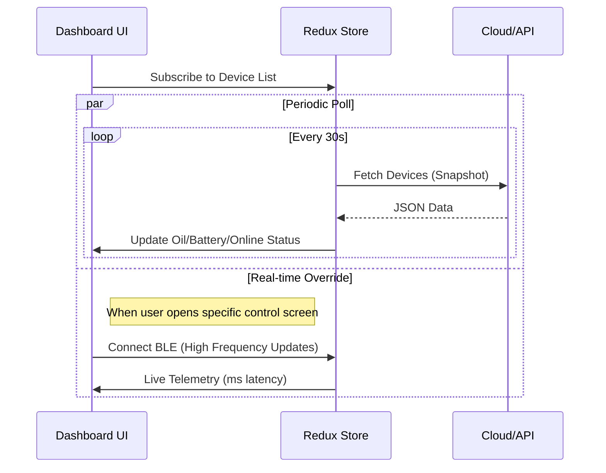

# Workflows & User Experience Diagrams

This document visually details the operational flows for Customers and Distributors within the IRIS platform.

## 1. High-Level Interaction Flow
This diagram illustrates how Customers and Distributors interact with the ecosystem.

## 2. User Experience (UX) Journey Maps

### A. Customer Journey
The end-to-end experience for a home or business user managing their own devices.

### B. Distributor Journey
The workflow for a distributor managing multiple clients and devices.

## 3. Detailed Sequence Diagrams

### A. Refill Service Loop (Customer <-> Distributor)
This sequence shows the lifecycle of a service request.

### B. Device Pairing & Control (BLE Flow)
How a customer claims and controls a hardware device.

### C. Data Sync Optimization
How the app ensures the dashboard is up-to-date without draining battery.

